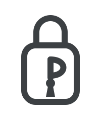

<p align="center">
  
</p>

# personal-secret

업무용 비밀 문자(SSH 접속, 서비스 자격증명, API 키, DB 접속, 인증서, 메모)를 한곳에 암호화 저장하는 **개인 로컬 시크릿 서버**.

- **api** — 도커 컨테이너에서 도는 FastAPI 서버 (`127.0.0.1` 전용). 암호화 저장 + 웹 UI + REST API.
- **cli** — 호스트에서 도는 `secret` 명령. macOS 키체인 + Touch ID로 unlock, `secret ssh <name>`으로 즉시 접속.

## 보안 모델

- 마스터 비밀번호 → **Argon2id**로 KEK 파생 → 랜덤 **DEK**를 KEK로 봉인(AES-256-GCM).
- 시크릿 본문은 DEK로 암호화되어 PostgreSQL에 저장. **DEK는 unlock 시에만 서버 메모리에 존재**(미사용 15분 후 자동 잠금).
- CLI가 호스트 macOS 키체인에 마스터 비밀번호를 보관하고 **Touch ID** 인증 뒤 unlock.
- api 포트는 **루프백 전용** 바인딩. 마스터 비밀번호 분실 시 복구 불가능.

> ⚠️ MVP 범위: unlock 상태에서 `127.0.0.1`로 들어오는 요청은 인증 없이 처리됩니다(단일 사용자 로컬 전제). 백업/Git 동기화/import는 추후 과제.

## 개발환경 실행

1. `.env` 생성

   ```bash
   cp .env/.env.develop.example .env/.env.develop
   ```

2. Dev Container 진입 (`Cmd+Shift+P`)
   - 최초: `Dev Containers: Rebuild and Reopen in Container`
   - 이후: `Dev Containers: Reopen in Container`

   또는 직접:

   ```bash
   sh scripts/develop/docker-compose-up.sh
   ```

3. API 서버 실행 (컨테이너 안)

   ```bash
   python -m personal_secret.api.bin.server
   ```

   웹 UI: <http://127.0.0.1:28200>

## 운영(production) 실행

코드를 이미지에 베이크해 불변 컨테이너로 띄웁니다(바인드 마운트·reload 없음, `restart: unless-stopped`).
develop과 포트가 겹치지 않아(api `28201`, postgres `25635`) 동시 구동 가능합니다.

1. `.env` 생성 후 **DB 비밀번호를 강력하게 변경**

   ```bash
   cp .env/.env.production.example .env/.env.production
   # PRODUCTION_POSTGRES_PASSWORD 등을 강한 값으로 수정
   ```

2. 빌드 → 기동 → 종료

   ```bash
   sh scripts/production/docker-compose-build.sh
   sh scripts/production/docker-compose-up.sh
   sh scripts/production/docker-compose-down.sh
   ```

   웹 UI: <http://127.0.0.1:28201>
   CLI를 production에 붙이려면: `export PERSONAL_SECRET_API=http://127.0.0.1:28201`

   > `scripts/*` 는 `git rev-parse` 로 루트를 찾으므로 먼저 `git init` 이 필요합니다(직접 `docker compose ... -f .docker/docker-compose.production.yml up` 도 가능).

## CLI 설치 (호스트, macOS)

```bash
sh scripts/install-cli.sh
ln -sf "$(pwd)/.venv-cli/bin/secret" /usr/local/bin/secret
```

> Python 3.13+ 필요 (`pyenv install 3.13`). 키체인/Touch ID/ssh는 호스트 전용이라 CLI는 컨테이너가 아닌 호스트에서 실행합니다.

## CLI 사용

```bash
secret init                       # 마스터 비밀번호 설정 + 키체인 저장
secret unlock                     # Touch ID로 unlock
secret status

secret add ssh prod-web --tag prod --field host=10.0.0.5 --field user=deploy --field key_path=~/.ssh/id_ed25519
secret add api stripe --expires 2026-12-31T00:00:00Z --field key   # 값은 숨김 입력
secret ls --kind ssh
secret get prod-web                # 평문 출력
secret get stripe --copy key       # 특정 필드만 클립보드로
secret ssh prod-web                # 저장된 정보로 즉시 ssh 접속
secret expiring --days 30          # 만료 임박 시크릿
secret rm old-thing
secret lock
```

## 아키텍처

`.claude/docs/python-architecture.md` · `.claude/docs/python-style.md` 의 DDD 5계층 규약을 따릅니다
(`endpoint → usecase → domain → infrastructure → core`).
